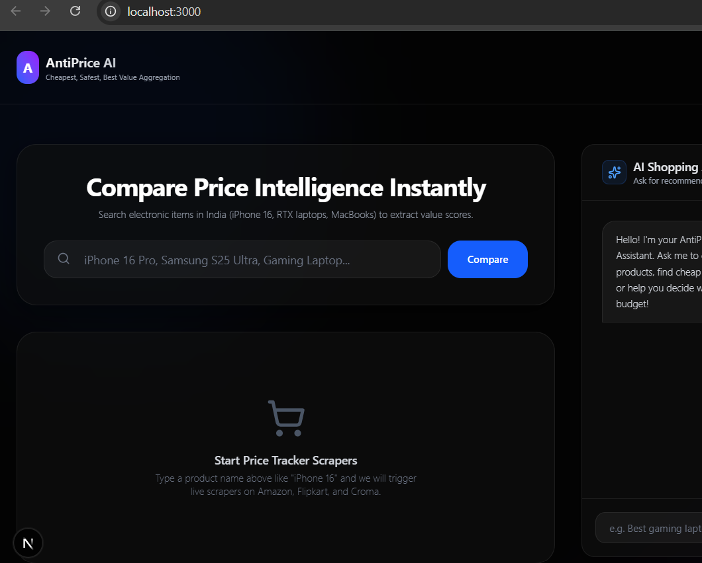
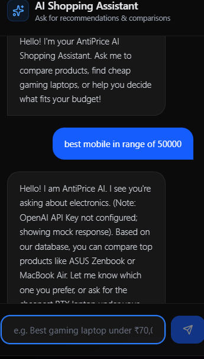
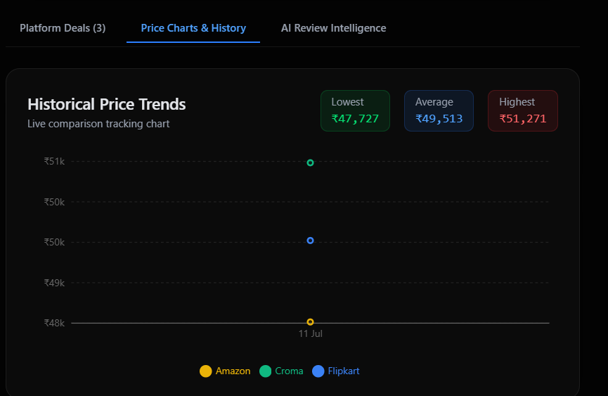

# AntiPrice AI

# 🤖 AntiPrice AI


AntiPrice AI is a startup-ready price intelligence aggregator platform. It tracks, compares, and predicts real-time electronics prices across major e-commerce platforms (Amazon, Flipkart, Croma) and provides AI recommendations, sentiment analysis, and a shopping assistant chatbot.


---

## Home Page

<p align="center">

</p>

---

## Product Comparison

<p align="center">

</p>

---

## AI Chatbot

<p align="center">

</p>

---

## Price Prediction

<p align="center">

</p>

## Docker Running (docker ps or Docker Desktop)

<p align="center">

</p>

---
## 🛠️ Project Directory Structure

```
antiprice-ai/
├── backend/               # NestJS Backend API
│   ├── src/
│   │   ├── ai/            # Ollama (Gemma 3) Sentiment, Review Analysis & Chatbot services
│   │   ├── prisma/        # Relational Database connection logic
│   │   ├── products/      # Products CRUD, Recommendations, Price history endpoints
│   │   ├── scraper/       # Playwright Scraper runners (Amazon, Flipkart, Croma) & BullMQ workers
│   │   └── search/        # Elasticsearch indexes and fuzzy search utilities
│   ├── prisma/            # Relational db scheme configuration
│   └── Dockerfile
├── frontend/              # Next.js 16 Web Dashboard UI
│   ├── src/
│   │   ├── app/           # App Router pages and globals
│   │   └── components/    # Recharts Charts, Chatbots, Alert setters, Review cards
│   └── Dockerfile
├── docker-compose.yml     # Local Infrastructure (PostgreSQL, Redis, Elasticsearch)
├── DEPLOYMENT.md          # Production AWS Deployment Guide
└── .github/
    └── workflows/         # GitHub Actions CI/CD workflows template
```

---

## 🚀 Running Locally

### 1. Prerequisites
- **Node.js** v24+ & **npm**
- **Docker Desktop** (for running local databases, caching, and search indices)

### 2. Setup Infrastructure
Start local PostgreSQL, Redis, and Elasticsearch containers:
```bash
docker compose up -d
```

### 3. Initialize NestJS Backend
1. Open a terminal and navigate to the backend directory:
   ```bash
   cd backend
   ```
2. Make sure local environment config `.env` exists:
   ```bash
 Install Ollama

```bash
ollama pull gemma3:4b
```

Run Ollama

```bash
ollama run gemma3:4b
```
   ```
3. Run Prisma migration (maps schema models to your running database):
   ```bash
   npx prisma db push
   ```
4. Start the backend developer service:
   ```bash
   npm run start:dev
   ```
   The backend API will run at `http://localhost:3001`.

### 4. Initialize Next.js Frontend
1. Open a new terminal and navigate to the frontend directory:
   ```bash
   cd frontend
   ```
2. Start the frontend developer dashboard:
   ```bash
   npm run dev
   ```
   Open `http://localhost:3000` in your web browser.

---

## 💡 AI-Powered Pricing Core Engines

1. **Cheapest Platform Identifier**: Scrapes multiple endpoints in real-time, matching prices, and compiling a **Value Index (0-100)** score.
2. **Review Summaries**: Uses Ollama (Gemma 3) to analyze customer reviews, identify praises and  complaints, and generate reliability scores.
3. **Linear Regression Forecasting**: Employs mathematical regressions to project pricing ranges for the next 7 and 30 days, suggesting buying actions.
4. **Fuzzy Search Indexes**: Uses Elasticsearch to run instant, type-tolerant matches over titles and brands.

## Features

- Compare prices from Amazon, Flipkart and Croma
- AI shopping assistant
- Product recommendations
- Price prediction
- Review summarization
- Elasticsearch search
- Dockerized deployment
- Real-time scraping

## Future Scope

- Google Login
- Wishlist
- Browser Extension
- Mobile App
- WhatsApp Notifications
- AI Review Analysis
- RAG (Retrieval Augmented Generation)
- AI Shopping Agent
- Voice Assistant

## Tech Stack

Frontend
- Next.js 16
- React
- TypeScript
- Tailwind CSS

Backend
- NestJS
- Prisma ORM
- TypeScript

Database
- PostgreSQL

Caching
- Redis

Search
- Elasticsearch

Web Scraping
- Playwright

AI
- Ollama
- Gemma 3 (4B)

# AntiPrice AI
![Next.js]
![NestJS]
![TypeScript]
![Docker]
![PostgreSQL]
![Redis]
![Elasticsearch]
![License]


## 🤖 Local AI Setup

Install Ollama

```bash
ollama pull gemma3:4b
```

Run the model

```bash
ollama run gemma3:4b
```

The AI assistant works completely offline without any OpenAI API key.

